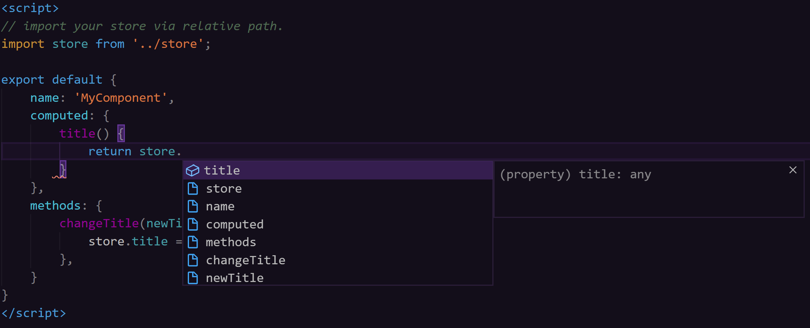
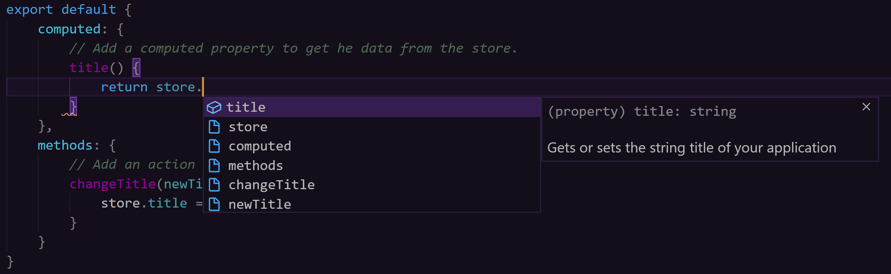
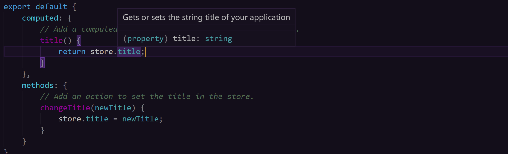

# vunion

## Introduction

```vunion``` is a centralized state management system for [Vuejs](https://vuejs.org/) designed with intellisense in mind. The goal of the plugin is to provide an easy way to create data stores and access them from any component while still providing intellisense.  It is an alternative to ```vuex``` which primarily uses ```strings``` in the components to map getters and execute actions.  We also wanted to allow more control over how your store is constructed allowing you to decide how abstracted it needs to be based on your use cases.

**Note:** We are currently in Alpha versions since this is a new project.  I would not suggest using this in a production application at this time since it is very untested.  If you like what you find here and want to help me test out the features I welcome the help.  Thanks to all in advance.


## Installation

``` sh
npm install vunion --save
```


## Setup

Ensure your Vue applications main.js has the following lines.

``` js
import Vue from 'vue';
import App from './App.vue';

// import vunion.
import vunion from 'vunion';
// And use it in Vue
Vue.use(vunion);

new Vue({
    render: h => h(App),
}).$mount('#app');
```

Now your application is ready to use vunion.


## Creating your stores

Stores in vunion are defined as modules. There is multiple ways to define them based on the level of abstraction you wish to have in your application.  This is just one example of how to create a simple store, for a more abstracted example you can check out our [Store Construction](./docs/STORE.md) section.

file: store.js
``` js
import {store} from 'vunion';

// Define the basic structure of your store.
store.schema({
    title: 'Example App'
})

// Then export your store.
export default {
    // Define a getter for your store property.
    get title(){
        return store.get('title');
    },
    // Define a setter for your store property.
    set title(value){
        store.commit('title', value);
    }
}
```

That's it... you have created a basic store.  Now this store can be imported into any Component that needs it.

``` html
<template>
    <div>
        <div>{{title}}</div>
        <button type="button" @click="changeTitle('New Title')">Change Title</button>
    </div>
</template>

<script>
// import your store via relative path.
import store from '../store';

export default {
    computed: {
        // Add a computed property to get he data from the store.
        title() {
            return store.title;
        }
    },
    methods: {
        // Add an method to set the title in the store.
        changeTitle(newTitle) {
            store.title = newTitle;
        }
    }
}
</script>
```

Because we import the store into the component, the title property is visible to intellisense and will show up when your typing your code.




## Intellisense Support

```vunion``` is written in Javascript with JSDocs, but we also provide TypeScript description files for those who prefer to use TypeScript.  If you prefer using JavaScript to write your Vue applications, we suggest that you include JSDoc sections to your store modules to allow for a richer intellisense experience in your components.

**Note:** An IDE that supports JSDocs (Like VSCode) is required for intellisense to work correctly.

File: store.js
``` js
import {store} from 'vunion';

// Define the basic structure of your store.
store.schema({
    message: 'Example App'
})

// Then export your store.
export default {
    /**
     * Gets or sets the string title of your application
     * @type String
     */
    get title(){
        return store.get('title');
    },
    set title(value){
        store.commit('title', value);
    }
}
```

When you are typing:



And on hover over the property:




## Lazy Loading

Unlike ```vuex``` which requires that you build your entire state at application start, the stores in ```vunion``` are lazy loaded when they are included in a Component. Once loaded the store will stay in the vunion state even after the component is destroyed, we just simply wait to load the store until it is needed.  This helps to keep the state as small as possible based on what parts of the application the user accesses.

Sometimes you need a store loaded at application start, simply import it in your primary App.vue and it will be loaded into the vunion state immediately. But only do this if it is necessary, most of the time waiting until a component that needs the state is loaded will keep memory usage for the overall state to a minimum.


## State Structure and Namespacing

Even though you can create as many ```stores``` as you want, they are all loaded into the same ```state```.  This is the same as it is in ```vuex```.  So defining the same property name in two different stores will cause them to overwrite each other during set operations.  To prevent this you have several options.


### Option 1: Ensure unique property names

The simplest way is to just give each of your properties in the stores schemas unique names.

file: store1.js
``` js
import {store} from 'vunion';

store.schema({
    store1_title: "Store 1 Title"
})

export default {
    // Define a getter for your store.
    get title(){
        return store.get('store1_title');
    },
    // Define a setter for your store property
    set title(value){
        store.commit('store1_title', value);
    }
}
```

file: store2.js
``` js
import {store} from 'vunion';

store.schema({
    store2_title: "Store 2 Title"
})

export default {
    // Define a getter for your store.
    get title(){
        return store.get('store2_title');
    },
    // Define a setter for your store property
    set title(value){
        store.commit('store2_title', value);
    }
}
```

This allows Components that import store1 or store2 to both use the title property, they just map to different reactive properties in the vunion state.


### Option 2: Namespacing

Another way to ensure your state properties are unique is to structure them inside child objects and then reference them with namespacing.

file: store1.js
``` js
import {store} from 'vunion';

store.schema({
    store1: {
        title: "Store 1 Title"
    }
})

export default {
    // Define a getter for your store.
    get title(){
        return store.get('store1.title');
    },
    // Define a setter for your store property
    set title(value){
        store.commit('store1.title', value);
    }
}
```

file: store2.js
``` js
import {store} from 'vunion';

store.schema({
    store2:{
        title: "Store 2 Title"
    }
})

export default {
    // Define a getter for your store.
    get title(){
        return store.get('store2/title');
    },
    // Define a setter for your store property
    set title(value){
        store.commit('store2/title', value);
    }
}
```

So the state does not HAVE to be a flat structure, it can go as deep as you need it to go so that your stores can be structured as you need them to be.

**Note:** the namespacing in store1.js used a "." between the property names while store2.js used "/".  Either option will work so feel free to use whichever syntax you prefer.


## Event Bus (Optional)

During the implementation of ```vunion``` we found it easy to include a light weight Event Bus that utilizes the built in Vue $emit $on system. This is an optional feature that is not required to be used to make the State Management process work.  If you want to know more about this Event Bus then check out the [Event Bus Section](./docs/BUS.md). 


## API

To help you on your progress using ```vunion``` we have a full [API Documentation Section](./docs/API.md) so you can deep dive into the options available to you.


## Under the Hood and Debugging

Another thing we wanted to accomplish with this project was a way to debug issues.  We are not a part of the Core Vue team so we are not able to fully integrate with the Vue Dev Tools extension, but we still tried to allow you to use this extension to fully debug the plugin.  For a full description on how ```vunion``` works and the best ways to debug it in the Dev Tools Extension, visit our [Debugging Section](./docs/DEBUG.md).

Lastly this is an Open Source project.  Feel free to check out the source code on our [GitHub Page](https://github.com/ThatWionGuy/vunion) and if you find any bugs please post them on the [Issues Section](https://github.com/ThatWionGuy/vunion/issues).


## Vue 3

We are in the works to change the Vunion state to use the Vue 3 native reactive objects.  This would be inline with Vue 3 and provide a better responsive state.  Once this happens this version of Vunion will be moved to a new branch and we will maintain it for 18 months support.

## License

[MIT](http://opensource.org/licenses/MIT)

Copyright (c) 2020-present, Johnathon Wion