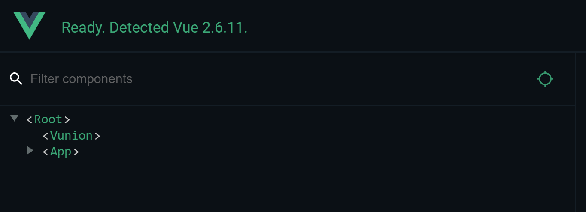
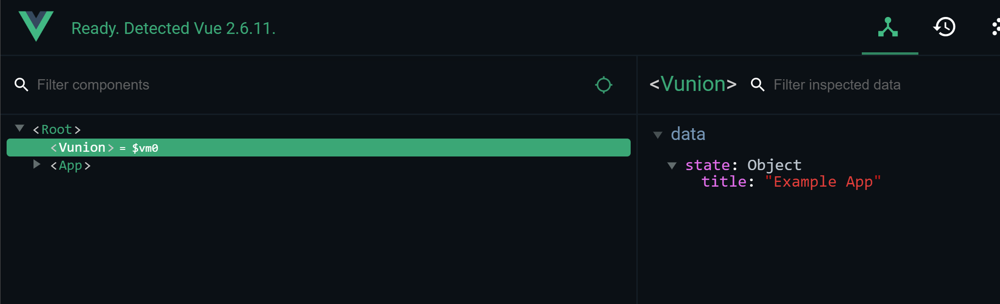
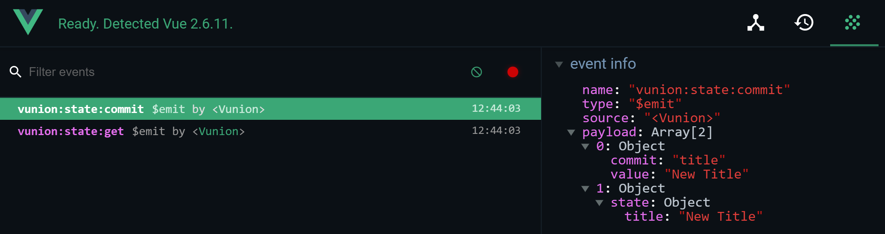
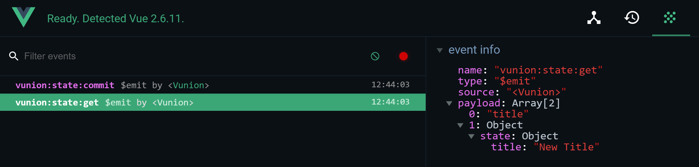
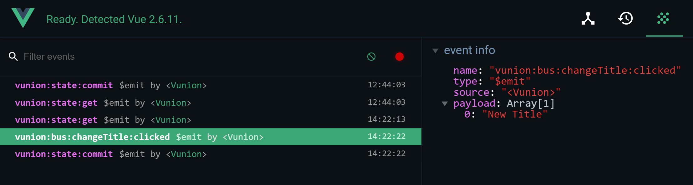

# Under the hood and Debugging

```vunion``` is built utilizing the Vue Instance to handle the state and reactivity.  By doing this we eliminate the need to manage the watches, subscriptions and changes.  Since Vue does a really good job of handling these things already, there is no real reason to reinvent the wheel.  And with the upcoming Vue Version 3 reactive model, things will only get better.  For now in Vue Version 2+ we are simply creating a Vue Component that acts as our state storage and event bus.  If you have Vue Dev Tools installed in Chrome you can see what I mean.  You should see something like this:



There is a ```Vunion``` Component directly under the ```Root``` Vue Instance.  This lives as a sibling to your main App.vue component.  Since we are using the observable ```data``` property of this instance we are able to view the current state right in the dev tools.  



For the Event Bus we are using the same ```Vunion``` instance to emit and listen to events.  The bus module is simply a proxy to this Vue Instance Events.  By doing this the events are only propagated to the Root Vue Instance and do not bubble down into your App so no Component scoped listeners will receive these events.  Only listeners that wire up to the Bus will receive them.

Again this feature is completely optional and was only offered since it was simple to include a proxy class that opened up access and provided isolated event propagation. You could totally do the same thing creating a new Vue Instance yourself and adding it to the Root Instance.  We just thought it might be useful to others and was so light weight that it did not effect package size.

## Tracking State Changes

Since ```vuex``` is considered the official State Management plugin, they have a dedicated tab in the Vue Dev Tools just for Vuex.  So since we do not have that, we wanted a way to give you access to the state change information, and ways to find the info you are looking for without a lot of troubles.  So we decided to use Events emitted from the Vunion instance to provide this.

**Note:** Before anyone starts asking questions... We use the Vue ```devTools``` Configuration setting and the window.__VUE_DEVTOOLS_GLOBAL_HOOK__ to determine if we should log or not.  So if the ```devTools``` configuration is set to false or the global hook is not there, then we do not log any activities which improves performance.

Each event is prefixed which allows you to quickly filter events in the Event Tab to just the ones that vunion is creating.  All state management events will start with ```vunion:state``` and the event bus events will all start with ```vunion:bus```.  This allows you to quickly filter just the events you want to see for the feature you are debugging.

### State Management Events

All state management events will be structured basically the same.  They will all start with ```vunion:state``` and also have the action that ocurred.  They will also have 2 values in the payload array.  The first being the information pertaining to the event itself and the second being the current state after the event.  The following events are emitted for tracking purposes:

|Event                  | Description and Payload |
|-----------------------|-------------------------|
| ```vunion:state:get```| Emitted each time the store.get method is executed.   Payload 1 - The value returned. |
| ```vunion:state:commit```| Emitted each time the store.commit method is executed.   Payload 1 - The property and value changed. |
| ```vunion:state:load```| Emitted each time a store is loaded into the state.   Payload 1 - The schema loaded |
| ```vunion:state:exported```| Emitted each time the store.getState method is executed.   Payload 1 - The state returned |
| ```vunion:state:imported```| Emitted each time the store.setState method is executed.   Payload 1 - The state loaded |

These can all be seen in the Vue Dev Tools Events Tab.






**Note:** Due to the dev tools loading after the page is rendered, some events will be buffered and stored until the Dev Tools are open.  So the timestamp for these events might be incorrect.  This is a known issue that we are working on.


### Event Bus Events

All Event Bus events will be structured the same.  They will all start with ```vunion:bus``` and also have the passed in event that ocurred.  The payload array for these events will be whatever ```args``` were passed into the ```$emit``` method.  So if we called this in our Component:

``` js
bus.$emit('changeTitle:clicked', 'New Title');
```

Then the event would look like this in the Vue Dev Tools:



So everything after the ```vunion:bus:``` is the event passed in to ```$emit```.  You can structure you custom global events however you need to so you can provide scope to ensure they are only handled by the correct listeners.


## Conclusion

By nesting the ```Vunion``` Component under the root, we have given you the ability to see the current state at any moment and alter it if you need to for testing.  And emitting events allows you to see all of the activities being conducted in the system so you can troubleshoot any issues you run into.

If you have suggestions for other events or addition data you would find relevant, feel free to make a feature request on our [Issues Section](https://github.com/ThatWionGuy/vunion/issues).

Lastly this is an Open Source project.  Feel free to check out the source code on our [GitHub Page](https://github.com/ThatWionGuy/vunion) and if you find any bugs please post them on the [Issues Section](https://github.com/ThatWionGuy/vunion/issues).