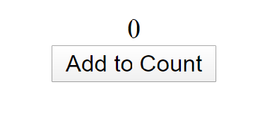

# Vunion Examples

This section will provide full examples that you can use to play around with ```vunion``` and get to know the plugin better.  All code will be provided so you can recreate these in your own sandbox if you would like.

**Note:** These are by no means production ready applications.  This is for POC purposes only.

Since this is a Vue Plugin we are not going to go over the basics of how to setup a Vue project.  For each sample application you will need to do the initial setup steps for vunion.

``` sh
npm install vunion --save
```

And insure that in your main.js you have the following.

``` js
import vunion from 'vunion';

Vue.use(vunion);
```

Here is a list of the Example apps if you want to jump to one specific one.

1. [Counter App](#Counter_App) - Oh come on... everyone does this one.
2. [Single Store](#Single_Store) - Just a simple web page with single store.
3. [Multiple Stores](#Multiple_Stores) - Using multiple stores with Namespacing.
4. [Full Abstraction](#Full_Abstraction) - Store designed with State Management Patter.

## Counter App

This is as simple as it gets.  If you have seen any Vue tutorials then I am sure this one is so over played, but it does show a simple structure and is easy to grasp the basic concepts.

### File Structure

Files with the ✚ next to them are the ones we will be adding and files with the ✎ next to them are the ones we are editing.

```
━ project_folder
    ┣━ node_modules
    ┣━ public
    ┣━ src
    ┃   ┣━ components
    ┃   ┃   ┗━ Counter.Vue ✚
    ┃   ┣━ App.vue ✎
    ┃   ┣━ main.js
    ┃   ┗━ store.js ✚
    ┗━ package.json
```

If you use the vue-cli to create the app you will need to delete the ```/src/components/HelloWorld.vue``` file

### store.js

``` js
import {store} from 'vunion'

store.schema({
    count: 0
})

export default {
    /**
     * Gets the count.
     * @type {String}
     */
    get count() { return store.get('count');},

    /**
     * Increments the count by 1.
     */
    incrementCount : () => {
        let value = store.get('count') + 1;
        store.commit('count', value);
    }
}
```

### Counter.Vue

``` html
<template>
    <div>
        <div>{{count}}</div>
        <div>
            <button type=button @click="addCount">Add to Count</button>
        </div>
    </div>
</template>

<script>
import store from '../store';
export default {
    computed: {
        count(){ return store.count; }
    },
    methods: {
        addCount(){
            store.incrementCount();
        }
    }
}
</script>
```

### App.vue

``` html
<template>
  <div id="app">
    <Counter />
  </div>
</template>

<script>
import Counter from './components/Counter.vue'

export default {
  name: 'App',
  components: {
    Counter
  }
}
</script>

<style>
#app {
  text-align: center;
}
</style>
```

When the application is run you will see the number 0 and a button below it. It should look similar to this:




## Single Store

## Multiple Stores

## Full Abstraction