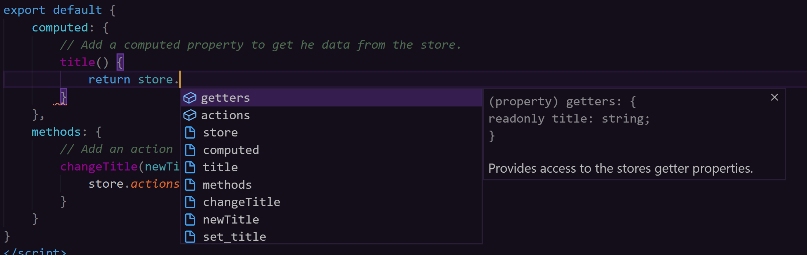
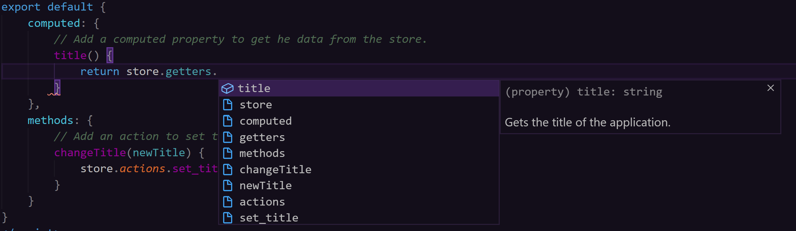

# vunion store construction

We wanted to make ```vunion``` flexible so that it could be used in a quick POC project, or in a large-scale enterprise level SPA. So instead of dictating your store structures, we simply provide the API to access the state, and allow you to create the store with as much abstraction as you need.

Here is an example of how you can structure your store in a State Management Pattern to be more like ```vuex```. There is more abstraction with less direct access to the state providing opportunities for more validation before actually changing the state.

File: store.js
``` js
import {store} from 'vunion';

// Define the basic structure of your store.
store.schema({
    message: 'Example App'
})

const mutations = {
    set_title: function(value){
        store.commit('title', value);
    }
}

/**
 * The main application store.
 */
export default {
    /**
     * Provides access to the stores getter properties.
     */
    getters: {
        /**
         * Gets the title of the application.
         * @type String
         */
        get title(){
            return store.get('title');
        }
    },
    /**
     * Provides access to the stores actions.
     */
    actions: {
        /**
         * Sets the title for the application.
         * @param {String} value - The string to use for the new title.
         */
        set_title: function(value){
            // Do validations or type checks here.
            mutations.set_title(value);
        }
    }
}
```

Then your Component would be changed to this:

``` html
<template>
    <div>
        <div>{{title}}</div>
        <button type="button" @click="changeTitle('New Title')">Change Title</button>
    </div>
</template>

<script>
// import your store via relative path.
import store from '../store';

export default {
    computed: {
        // Add a computed property to get he data from the store.
        title() {
            return store.getters.title;
        }
    },
    methods: {
        // Add an action to set the title in the store.
        changeTitle(newTitle) {
            store.actions.set_title(newTitle);
        }
    }
}
</script>
```

As you can see, the structure of your store can be as simple or complex as your application needs.  All with retaining the intellisense support.



